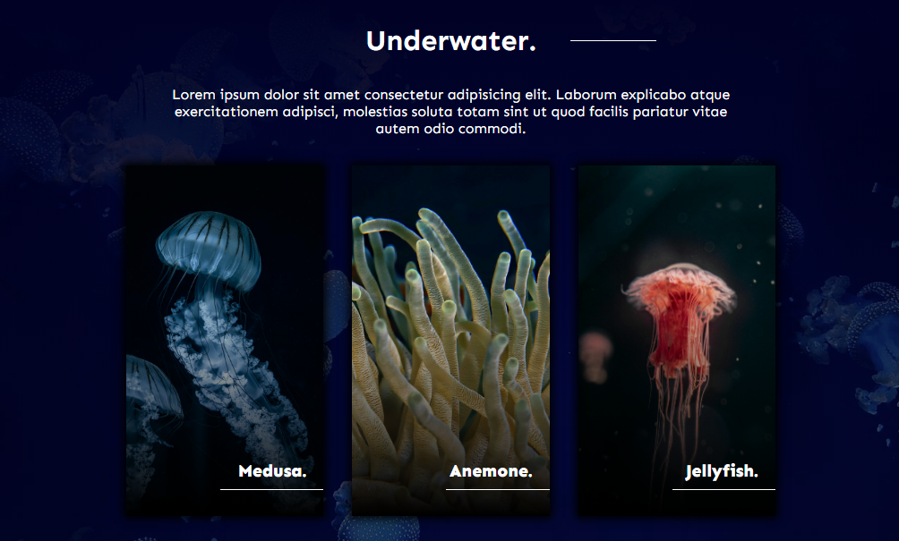

# Web simple

- Maquetado tomando como referencia un diseño de pinterest.

## Tecnologías usadas

> **Aclaraciones:** (FAQs)
>
> No ha sido probado para tener soporte crossbrowsing
>
> Ha sido programado con fines de entretenimiento

<!-- 

 -->

---

## 📄 Licencia

MIT Public License v3.0
No puede usarse comercialmente